# 🚀 EDA & Machine Learning Suite

A complete **Exploratory Data Analysis (EDA)** and **Machine Learning Dashboard** built using Python and Streamlit to analyze datasets, uncover insights, and build predictive models.

> **By:** Makaranth Prasath T

---

## 📌 Project Overview

This project focuses on:

- 🔍 Performing in-depth data analysis
- 📊 Visualizing patterns and trends
- 🤖 Building machine learning models
- 📈 Evaluating performance using ROC curve and confusion matrix
- 🖥️ Providing an interactive Streamlit dashboard

---

## 🚀 Features

- ✅ Data Cleaning & Preprocessing
- 📋 Statistical Summary & Insights
- 📊 Interactive Visualizations
- 🔗 Correlation Analysis
- 🤖 Machine Learning Model (Classification)
- 📈 ROC Curve & Confusion Matrix
- 🌐 Streamlit Web Dashboard

---

## ⚙️ Tech Stack

| Tool | Purpose |
|------|---------|
| Python | Core language |
| Pandas & NumPy | Data processing |
| Matplotlib & Seaborn | Visualizations |
| Scikit-learn | ML model |
| Streamlit | Web interface |

---

## 🗂️ Project Structure

```
EDA-ML-Suite/
│
├── data/
│   ├── raw_data.csv
│   └── cleaned_data.csv
│
├── notebooks/
│   └── eda.ipynb
│
├── app.py
├── requirements.txt
└── README.md
```

---

## 📊 Dataset

You can use datasets from:
- [Kaggle](https://www.kaggle.com)
- [UCI Machine Learning Repository](https://archive.ics.uci.edu/ml/index.php)

**Example datasets:**
- 🚢 Titanic Dataset
- 🌸 Iris Dataset
- 🩺 Diabetes Dataset

---

## ▶️ Installation & Setup

**1. Clone the repository**

```bash
git clone https://github.com/your-username/EDA-ML-Suite.git
cd EDA-ML-Suite
```

**2. Install dependencies**

```bash
pip install -r requirements.txt
```

**3. Run the application**

```bash
streamlit run app.py
```

---

## 🧠 Machine Learning Workflow

1. Load dataset
2. Clean and preprocess data
3. Perform EDA
4. Visualize patterns
5. Train ML model
6. Evaluate model using:
   - ✅ Accuracy
   - 📊 Confusion Matrix
   - 📈 ROC Curve

---

## 🖥️ Dashboard Preview

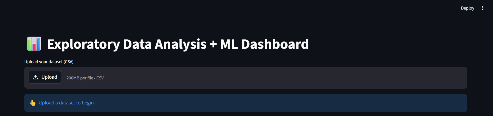
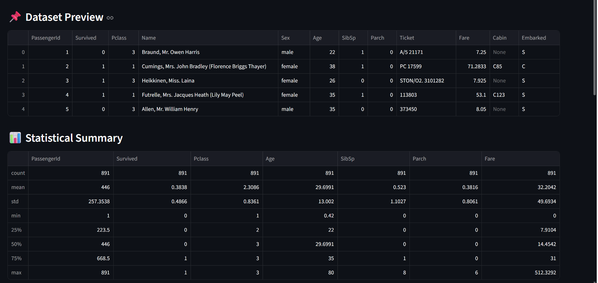
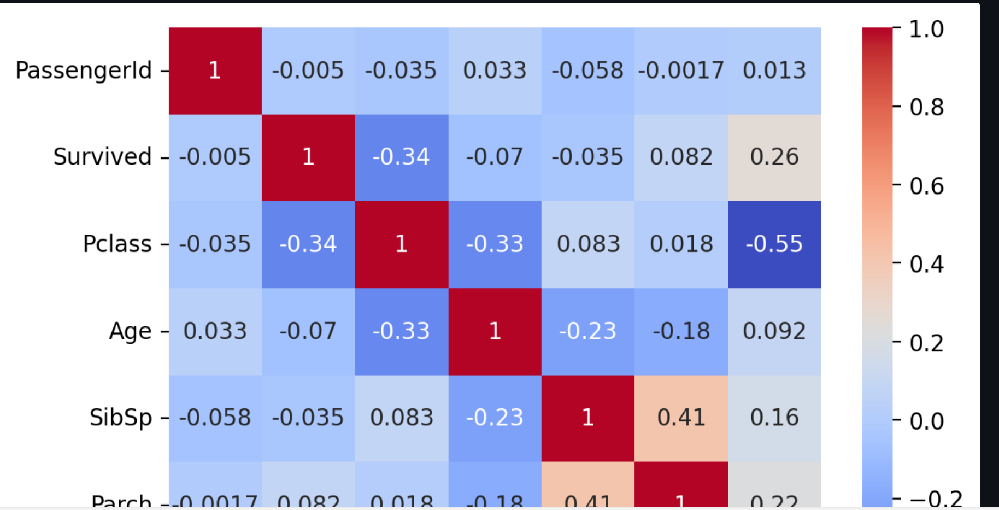
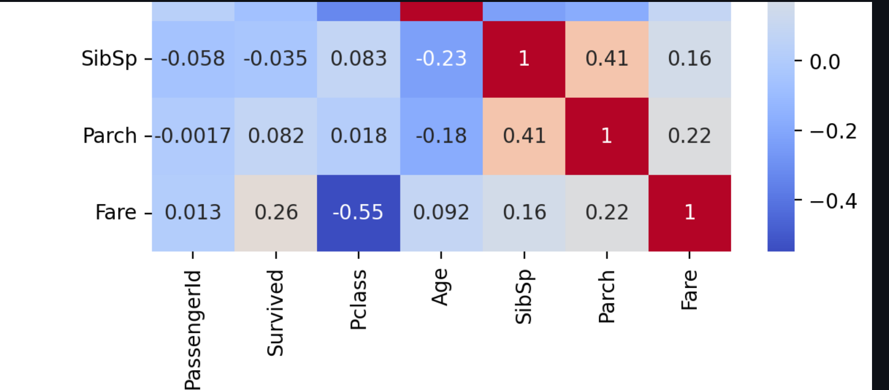
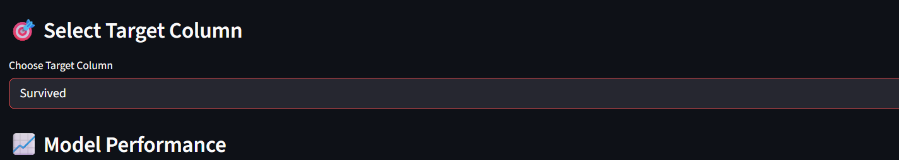
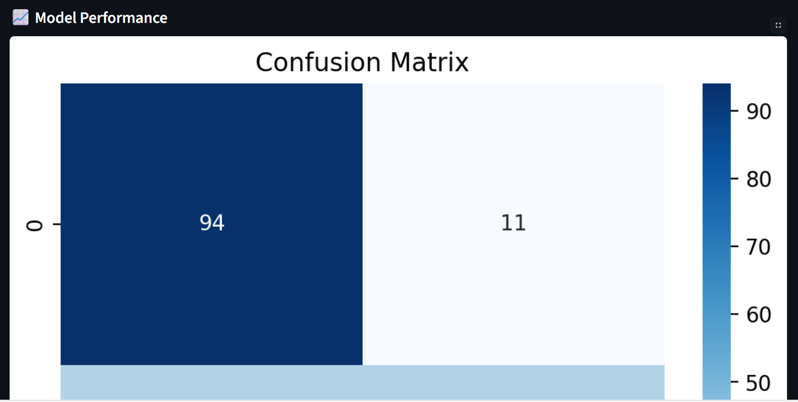
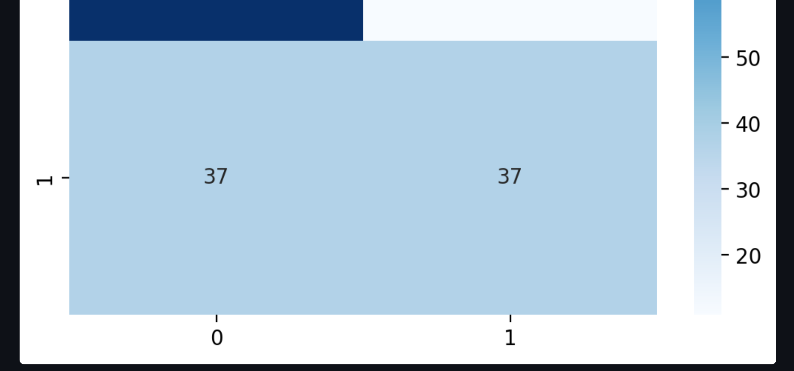
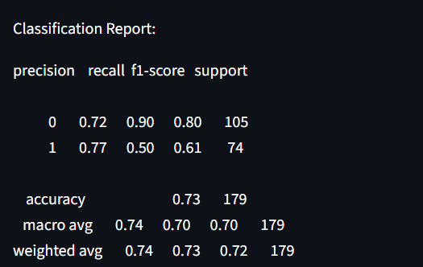
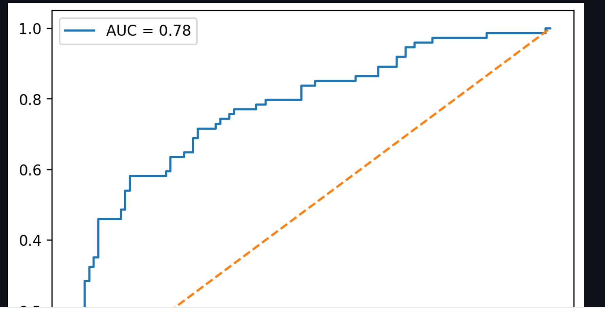
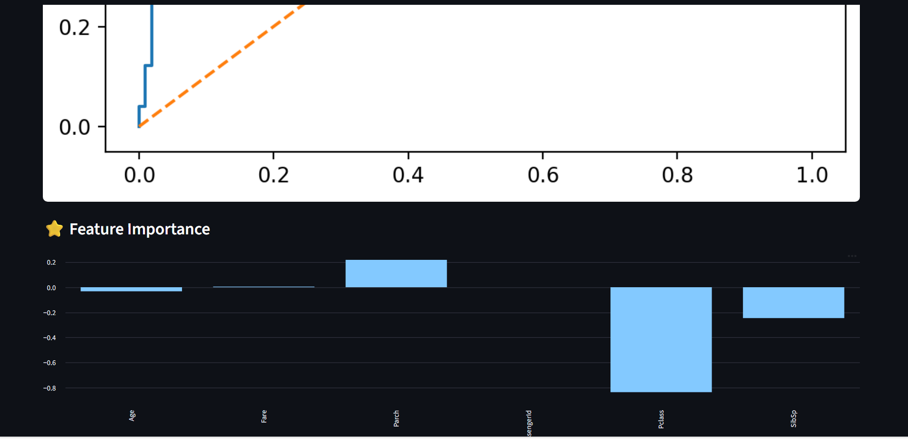
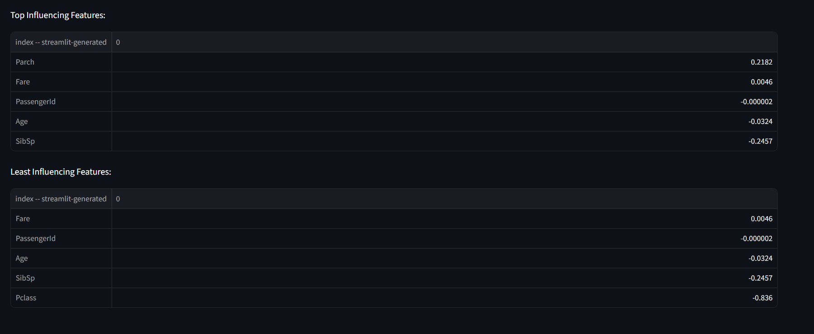

---

## 📄 Project Report

Download the full project report here: [📥 Download Report](./eda_report.pdf)

---

## 💡 Key Learnings

- Data preprocessing techniques
- Feature selection strategies
- Data visualization best practices
- Model evaluation metrics
- Building interactive dashboards with Streamlit

---

## 🔮 Future Improvements

- [ ] Add more ML models (Random Forest, XGBoost)
- [ ] Hyperparameter tuning
- [ ] Deploy on cloud (AWS / Render)
- [ ] Real-time data integration

---

> Made with ❤️ by Makaranth Prasath T
